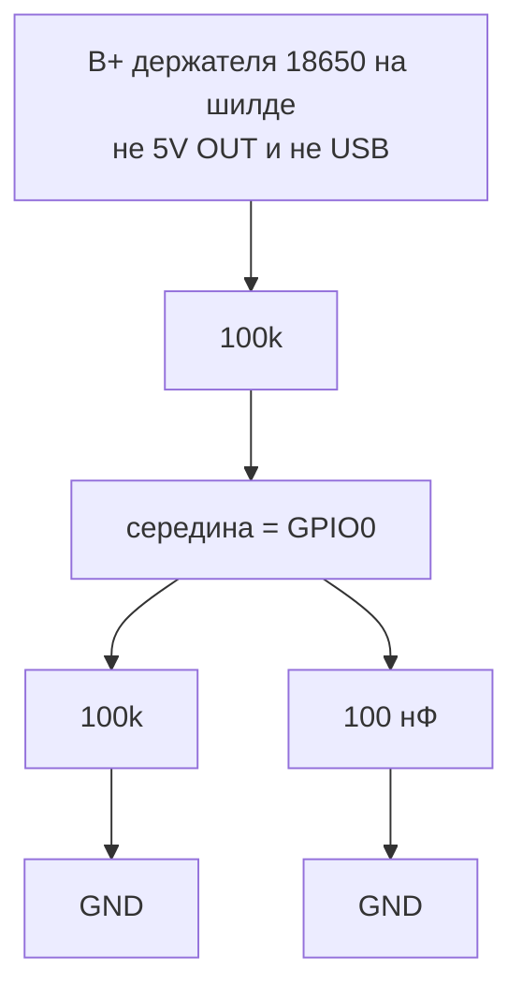
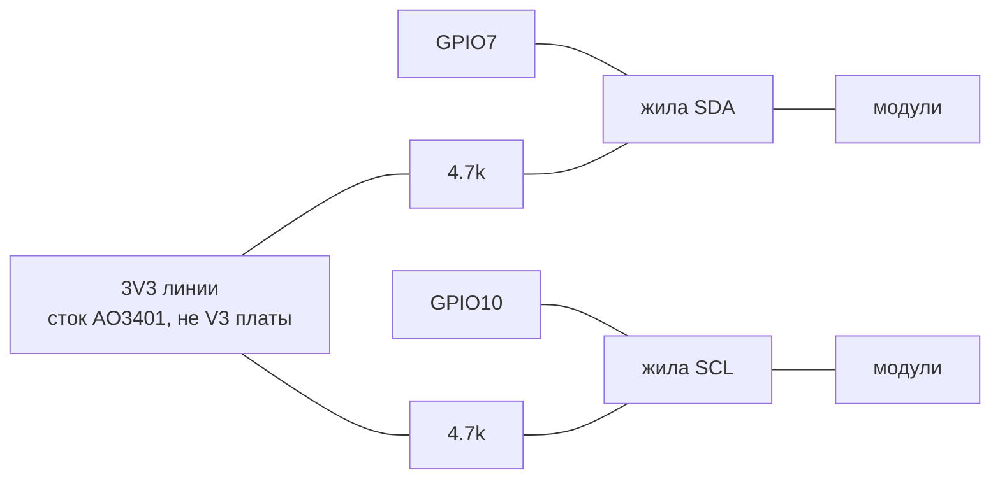

# Распиновка: что куда

Источник истины для прошивки — [`firmware/src/board_config.h`](../../firmware/src/board_config.h). Общая схема и обоснования — [`wiring.md`](wiring.md). Наглядная версия с рисунком платы и экранов — [`pins.html`](pins.html). Меняете провод — меняйте `board_config.h`, оба `.md` и оба `.html` в одном изменении.

Плата базы: **ESP32-C3 с OLED 0.42"** (72×40, SSD1306, I²C 0x3C на GPIO5/GPIO6; продаётся как «ESP32-C3 0.42 OLED», 01Space ESP32-C3-0.42LCD и клоны). Распиновка **отличается** от ESP32-C3 SuperMini — с ней не путать.

```mermaid
flowchart LR
  subgraph left[" "]
    V5["5V → V5"]
    GD["GND → GD"]
    V3["3V3 → V3"]
    PUMP["помпа → RX GPIO20"]
    NC["не использовать → TX GPIO21"]
    BAT["АКБ АЦП → GPIO0"]
    LVL["уровень → GPIO1"]
    SW["ключ линии → GPIO2"]
  end
  subgraph pcb["ESP32-C3 OLED 0.42"]
    direction TB
    RST["RST"] --- BOO["BOO = BOOT = GPIO9"]
    OLED["OLED 72×40"]
  end
  subgraph right[" "]
    SCL["GPIO10 → SCL линии"]
    BOOT["GPIO9 BOOT на плате"]
    LED8["GPIO8 синий LED на плате"]
    SDA["GPIO7 → SDA линии"]
    OLED_SCL["GPIO6 OLED SCL занят"]
    OLED_SDA["GPIO5 OLED SDA занят"]
    LED4["GPIO4 → красный LED"]
    BTN["GPIO3 → кнопка пробуждения"]
  end
  left --- pcb --- right
```

Расположение контактов по сторонам у разных партий может отличаться — сверяйтесь с **подписями на плате**, а не с картинкой.

## 1. ESP32-C3: все выводы

| GPIO | Подпись | Назначение | Подключение | Почему именно он |
|------|---------|------------|-------------|------------------|
| 0 | 0 | АЦП напряжения АКБ | середина делителя 100k/100k от B+ 18650, 100 нФ на GND | ADC1; делитель ×2: 4.2 В → 2.1 В |
| 1 | 1 | датчик уровня воды | выход датчика (5 В — через делитель 10k/20k; открытый коллектор — подтяжка 10k к 3V3) | цифровой вход |
| 2 | 2 | ключ питания линии | затвор P-MOSFET (AO3401), **10k к 3V3** | strapping-пин: подтяжка вверх и так обязательна; LOW = линия включена |
| 3 | 3 | **кнопка пробуждения** | кнопка на GND, **10k к 3V3** | из глубокого сна C3 будят только GPIO0–5 |
| 4 | 4 | красный LED тревоги | анод через 2.2k (яркий LED) … 1k, катод на GND | держится включённым во сне (GPIO hold) |
| 5 | 5 | OLED SDA | на плате | занят дисплеем |
| 6 | 6 | OLED SCL | на плате | занят дисплеем |
| 7 | 7 | SDA линии модулей | жила SDA, подтяжка 4.7k к **3V3 линии** (после ключа) | аппаратный I²C |
| 8 | 8 | синий LED на плате | — | strapping-пин, ничего не подключать |
| 9 | 9 / BOO | кнопка BOOT на плате | — | второе нажатие = сон, 5 с = сброс Wi-Fi; разбудить не может |
| 10 | 10 | SCL линии модулей | жила SCL, подтяжка 4.7k к **3V3 линии** | аппаратный I²C |
| 20 | RX | вход MOSFET-модуля помпы | IN/SIG модуля, **10k на GND** | держится LOW во сне; не дёргается при загрузке |
| 21 | TX | не используется | — | ROM-загрузчик пишет сюда лог при каждом старте — ничего, что включает воду |
| — | V5 | питание платы | 5 В с Shield V8 | |
| — | V3 | 3.3 В | исток P-MOSFET ключа линии, подтяжки кнопки/ключа | LDO платы, не более ~200 мА суммарно |
| — | GD | земля | общая земля | |

**Нельзя:** подавать 5 В на любой GPIO (не толерантны), подтягивать GPIO8/GPIO9 к земле (плата не загрузится), вешать нагрузку на GPIO21.

## 2. База: остальные узлы

| Узел | Вывод | Куда | Примечание |
|------|-------|------|------------|
| Shield V8 | вход USB (заряд) | USB-зарядка 5 В | основной вариант |
| Mini560 *(опц.)* | IN+ / IN− | солнечная панель / адаптер 7–32 В | только если источник выше 5 В |
| Mini560 *(опц.)* | OUT+ / OUT− | вход заряда Shield V8 (5 В) | |
| Shield V8 | 5V OUT | V5 ESP32, VIN+ MOSFET помпы, «+» помпы, жила 5V линии (через предохранитель) | выключатель шилда — в «ON» |
| Shield V8 | контакт «+» держателя 18650 | верх делителя АКБ (100k) | паять провод к держателю |
| MOSFET помпы | VIN+ / VIN− | 5 В / GND | |
| MOSFET помпы | IN / SIG (или IN+ / IN−) | GPIO20 (RX) / GND | 10k с GPIO20 на GND |
| MOSFET помпы | OUT+ / OUT− | «+» / «−» помпы | |
| 1N4007 (помпа) | | параллельно помпе | катод (полоска) к «+» |
| Датчик уровня | VCC / GND / OUT | 5 В / GND / GPIO1 | см. делитель выше |
| Кнопка пробуждения | 2 вывода | GPIO3 и GND | 10k GPIO3 → V3; 100 нФ параллельно кнопке от дребезга (опц.) |
| Красный LED | анод / катод | GPIO4 через резистор / GND | |
| AO3401 (ключ линии) | S / G / D | V3 / GPIO2 (+10k к V3) / жила 3V3 линии | P-MOSFET SOT-23, логический уровень |
| Подтяжки I²C 4.7k | | SDA→3V3 линии, SCL→3V3 линии | **после ключа**, иначе во сне подтяжки питают обесточенные ADS1115 через их защитные диоды |
| Самовосст. предохранитель 1.5–2 А | | в разрыв 5V линии | КЗ в кабеле не роняет базу |

### Делитель АКБ (GPIO0)

АЦП ESP32-C3 не переживёт 4.2 В с банки. Два одинаковых 100k делят напряжение пополам: 4.2 В на банке → 2.1 В на пине (ещё влезает в АЦП). Конденсатор 100 нФ с GPIO0 на GND — чтобы АЦП не «дрожал» на высокоомном делителе.

Три вывода: верх 100k к B+, низ 100k к GND, середина (и одна нога конденсатора) к GPIO0. Ток через делитель ≈ 4 В / 200k ≈ 20 мкА — банку почти не сажает. Если средний пункт ниже ~1.25 В после пересчёта ×2 (~2.5 В на банке), прошивка считает, что АКБ нет или провод оборван, и насос не включает.

### Подтяжки I²C 4.7k (GPIO7 и GPIO10)

SDA и SCL — открытый сток: чипы умеют только притягивать линию к земле. Чтобы она сама поднималась в «1», на **базе** ставят по резистору 4.7k. На модулях подтяжек быть не должно (если на плате ADS1115 уже стоят 10k — для четырёх штук ещё терпимо, лучше снять).

Жила идёт напрямую. Резистор не вставлять между GPIO и кабелем.

Почему к 3V3 линии, а не к V3 платы: во сне ключ выключает питание модулей. Если подтянуть шину к всегда живому V3, ток пойдёт в обесточенные ADS1115 через защитные диоды на SDA/SCL — чипы «полуживые», ток утечки, клапаны в неопределённом состоянии.

Почему не к 5 В: GPIO ESP32-C3 не 5-вольтовые.

Два резистора паяются у базы, по одному на каждую жилу. 4.7k (не 10k): кабель длинный, ёмкость большая, на 20 кГц 4.7k ещё успевает зарядить линию.

## 3. Разъём линии (база → модуль 1 → модуль 2 …)

| Конт. | Сигнал | Cat5e (пример) | Направление |
|-------|--------|----------------|-------------|
| 1 | 5V | синяя пара (обе жилы) | питание клапанов |
| 2 | GND | коричневая пара + бело-оранжевая | общая земля |
| 3 | 3V3 линии | бело-зелёная | питание ADS1115 и датчиков (после ключа) |
| 4 | SDA | оранжевая | I²C |
| 5 | SCL | зелёная | I²C |

Разъём на каждом модуле — **IN** и **OUT**, все 5 линий проходят насквозь. Удобно GX16-5 / SP13-5.

## 4. Модуль полива

| Узел | Вывод | Куда | Примечание |
|------|-------|------|------------|
| ADS1115 | VDD / GND | 3V3 линии / GND | **не 5 В**: при VDD = 5 В «единица» I²C = 3.5 В, ESP32 её не даст |
| ADS1115 | SDA / SCL | SDA / SCL линии | без подтяжек на модуле (снять/не ставить, если есть на плате ADS — 10k на всех модулях параллельно ещё терпимо для 4 шт.) |
| ADS1115 | ADDR | адрес модуля | GND = 0x48 (№1), VDD = 0x49 (№2), SDA = 0x4A (№3), SCL = 0x4B (№4) |
| ADS1115 | A0 | AOUT датчика влажности | |
| ADS1115 | A1 | *(опц.)* делитель 100k/100k от 5V линии | замер просадки на клапане (`lineSense`). Не 10k: во сне 5 В есть, а VDD ADS1115 снят — 10k/10k подпитывали бы 3V3 линии через A1 |
| ADS1115 | A2 / A3 | не используются | на GND |
| ADS1115 | ALRT | IN− MOSFET-модуля клапана | открытый сток; **никаких** подтяжек к 5 В |
| MOSFET клапана | IN+ / IN− | 3V3 линии / ALRT | вариант с оптроном PC817 на плате; без оптрона — PNP-инвертор, см. wiring.md §3 |
| MOSFET клапана | VIN+ / VIN− | 5V / GND линии | |
| MOSFET клапана | OUT+ / OUT− | «+» / «−» клапана CONJOIN | клапан **нормально закрытый** |
| 1N4007 (клапан) | | параллельно катушке | катод к «+» |
| Датчик влажности | VCC / GND / AOUT | 3V3 линии / GND / A0 | |

## 5. Что где на экране

| Экран | Когда | Что видно |
|-------|-------|-----------|
| Статус | без проверки и полива | слева сверху значок Wi-Fi (только сессия с кнопки; мигает = подключается; «AP» = точка доступа), справа сверху % и значок батареи; по центру время |
| Проверка | плановое пробуждение или «Измерить» | `#N` — номер горшка (модуля), крупно — влажность `NN%` (или `--` при ошибке датчика), 2.5 с на горшок |
| Полив | открыт клапан | `#N`, капля, оставшиеся секунды |
| Тревоги | всегда в верхней строке | перечёркнутая капля = нет воды; пустая мигающая батарея = низкий заряд |
| `zZz` | перед сном | ~0.6 с, затем дисплей выключается |
| `ERR!` | клапан не подтвердил закрытие | насос заблокирован, база повторяет закрытие |

Красный LED горит при любой тревоге и **не гаснет во сне**. Снимается только при пробуждении (по расписанию или кнопкой), если условие ушло: вода есть и заряд выше порога «Мин. заряд для старта».
