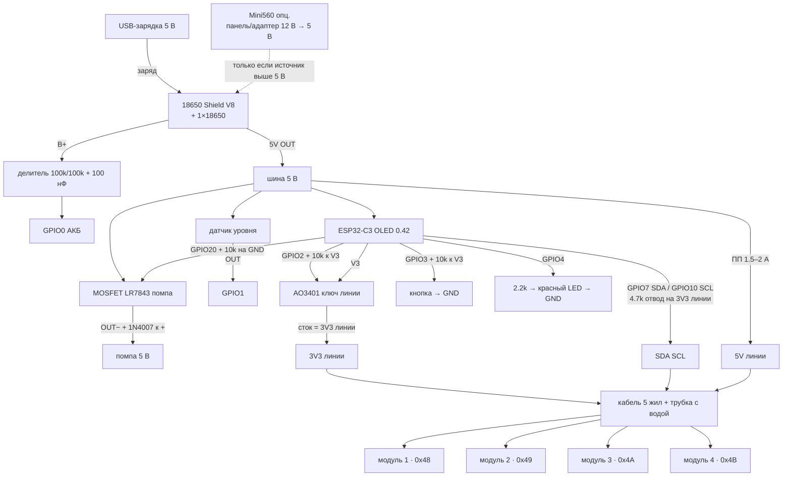
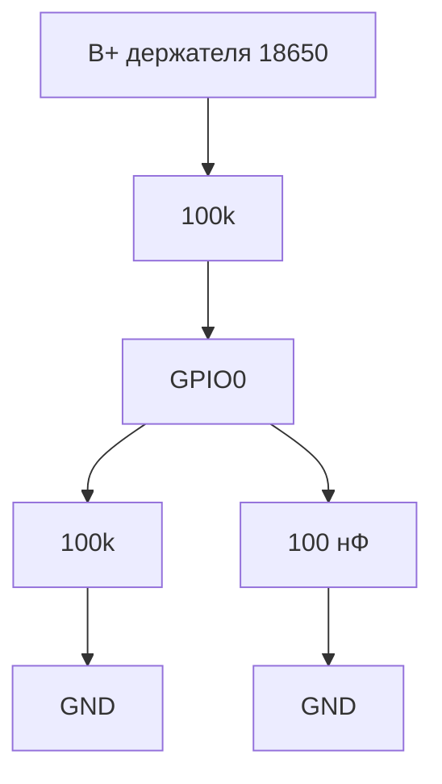
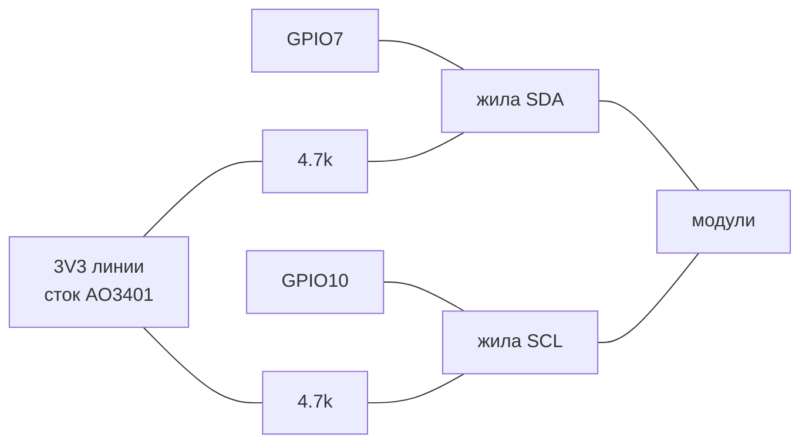
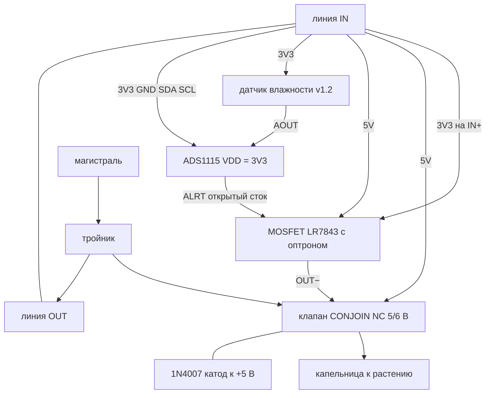
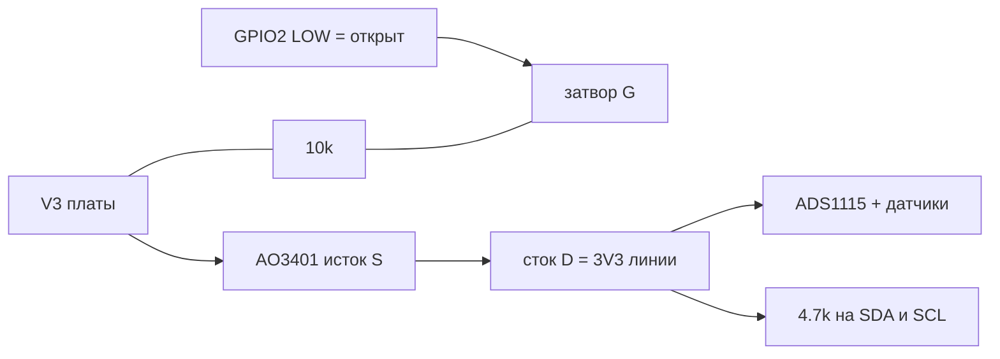
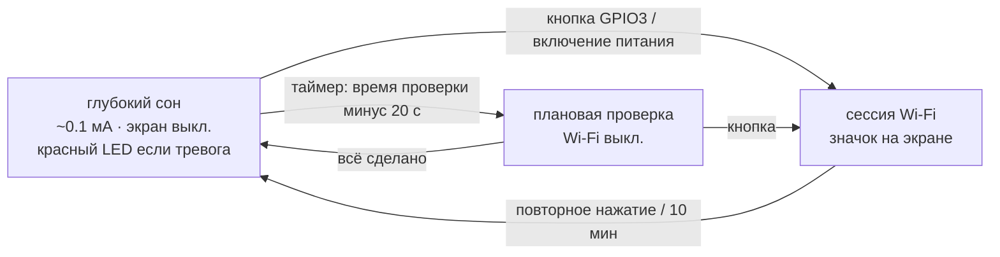

# Схема подключения

Пины в прошивке — [`firmware/src/board_config.h`](../../firmware/src/board_config.h), таблица «что куда» по каждому выводу — [`pins.md`](pins.md). Наглядная версия со схемами — [`wiring.html`](wiring.html). Меняете проводку — меняйте `board_config.h`, оба `.md` и оба `.html` в одном изменении.

## 1. Общая схема

Положение модуля в цепочке на адрес **не влияет**: адрес задаётся перемычкой ADDR на ADS1115. Модули можно переставлять, но два модуля с одинаковым адресом на одной линии работать не будут.

## 2. База

**Питание.** Шилд V8 заряжается от 5 В через свой USB-вход — подойдёт обычная USB-зарядка или 5–6-вольтовая USB-панель. Mini560 (7–32 → 5 В) нужен **только** если источник выше 5 В: панель 12 В (Voc 18–22 В), автомобильный/12-вольтовый адаптер. Подавать 12 В на шилд напрямую нельзя — сгорит зарядная микросхема.

| Узел | Вывод | Куда | Примечание |
|------|-------|------|------------|
| ESP32-C3 | V5 | шина 5 В с Shield V8 | |
| ESP32-C3 | GD | общая земля | |
| ESP32-C3 | GPIO0 | средняя точка делителя 100k/100k от **B+** аккумулятора | см. «Делитель АКБ» ниже |
| ESP32-C3 | GPIO1 | выход датчика уровня воды | Если выход датчика 5 В — делитель 10k (сверху) / 20k (снизу). Если открытый коллектор — подтяжка 10k к 3V3, без делителя |
| ESP32-C3 | GPIO2 | затвор P-MOSFET ключа линии | 10k к V3: линия выключена при сбросе и во сне. См. §5 |
| ESP32-C3 | GPIO3 | кнопка пробуждения → GND | Внешняя подтяжка 10k к 3V3. **Встроенная BOOT (GPIO9) будить не может** — эта кнопка обязательна |
| ESP32-C3 | GPIO4 | красный LED тревоги | через 2.2k на GND; горит и во сне |
| ESP32-C3 | GPIO5/6 | OLED на плате | заняты, не использовать |
| ESP32-C3 | GPIO7 | SDA линии | + 4.7k к **3V3 линии** |
| ESP32-C3 | GPIO10 | SCL линии | + 4.7k к **3V3 линии** |
| ESP32-C3 | GPIO8 | встроенный синий LED | индикация, не трогать |
| ESP32-C3 | GPIO9 | встроенная BOOT | в сессии: короткое = сон, 5 с = сброс Wi-Fi |
| ESP32-C3 | GPIO20 (RX) | вход MOSFET-модуля насоса | + 10k на GND: насос выключен, пока прошивка не стартовала; во сне пин удерживается в LOW |
| AO3401 | сток | жила 3V3 линии | питание ADS1115 и датчиков влажности (~5 мА на модуль) |
| MOSFET насоса | VIN+/VIN− | 5 В / GND | |
| MOSFET насоса | OUT− | минус насоса | плюс насоса — на 5 В |
| 1N4007 | | параллельно насосу | катод (полоска) к «+» |
| Датчик уровня | VCC / GND | 5 В / GND | |
| Линия 5 В | | через самовосстанавливающийся предохранитель ~1.5–2 А | короткое в кабеле не должно ронять базу |

**Почему подтяжки I²C к 3V3, а не к 5 В:** выводы ESP32-C3 не толерантны к 5 В. По той же причине ADS1115 питается от **3V3**: при VDD = 5 В порог «единицы» ADS1115 = 0.7 × VDD = 3.5 В, и 3.3 В от ESP32 он может не распознать.

### Делитель АКБ (GPIO0)

Не путать с 5V OUT шилда. Провод идёт на **плюс держателя 18650** (B+). АЦП пина максимум ~2.5–3.3 В, банка даёт до 4.2 В — поэтому два 100k делят пополам.

100 нФ с GPIO0 на GND: делитель высокоомный, без конденсатора отсчёт АЦП скачет. 100k/100k почти не сажают банку (~20 мкА).

### Подтяжки I²C 4.7k

Два резистора **на базе**, не на каждом модуле. Один конец каждого — к своей жиле (SDA или SCL), второй — к **стоку AO3401** (жила «3V3 линии»).

Жила GPIO → кабель непрерывная. Если повесить 4.7k на V3 платы, во сне шина останется в 3.3 В и через защитные диоды ADS1115 будет их питать.

## 3. Модуль полива

| Узел | Вывод | Куда |
|------|-------|------|
| ADS1115 | VDD / GND | 3V3 / GND линии |
| ADS1115 | SDA / SCL | SDA / SCL линии (проходят насквозь к следующему модулю) |
| ADS1115 | ADDR | GND → 0x48, VDD → 0x49, SDA → 0x4A, SCL → 0x4B |
| ADS1115 | A0 | AOUT ёмкостного датчика |
| ADS1115 | A1 | *(опц.)* делитель 100k/100k от линии 5 В — диагностика просадки на кабеле. Не 10k: во сне 5 В есть, а VDD ADS1115 снят |
| ADS1115 | ALRT | вход MOSFET-модуля (см. ниже) |
| Датчик влажности | VCC / GND | 3V3 / GND линии |
| MOSFET клапана | VIN+ / VIN− | 5 В / GND линии |
| MOSFET клапана | OUT− | минус клапана; плюс клапана — на 5 В |
| 1N4007 | | параллельно катушке клапана, катод к «+» |

### Как ADS1115 управляет клапаном

У ADS1115 нет выходов общего назначения. Используется вывод **ALERT/RDY** — открытый сток компаратора:

- **после подачи питания** компаратор выключен, ALRT в высокоимпедансном состоянии → ток через светодиод оптрона не течёт → **клапан закрыт**. Это верно и при обрыве I²C, и после перезагрузки ESP32;
- команда «открыть»: прошивка включает компаратор с порогами, при которых он срабатывает всегда → ALRT притянут к GND → светодиод оптрона светится → MOSFET открыт → клапан открыт.

Подключение входа MOSFET-модуля с оптроном (PC817 на плате): **IN+ → 3V3**, **IN− → ALRT**. Ток светодиода ~1.5–2 мА через резистор модуля — в пределах возможностей ALRT (3 мА при 0.4 В).

**Проверьте свою плату LR7843.** Если на ней нет оптрона (вход сразу идёт на затвор через резистор), схема выше не работает: открытый сток не может выдать «единицу». Тогда нужен инвертор, например PNP BC557: эмиттер → 3V3, база → 4.7k → ALRT и 10k база–эмиттер, коллектор → вход MOSFET-модуля. Закрытое состояние по умолчанию сохраняется.

**Нельзя** подтягивать ALRT к 5 В: максимум на выводе — VDD + 0.3 В = 3.6 В.

### Клапан CONJOIN

- Нужен **нормально закрытый** клапан. Проверьте мультиметром/водой до установки.
- У 3-ходовой версии третий порт — сброс: в закрытом состоянии вода уйдёт через него. Используйте 2-ходовую или **заглушите** третий порт.
- Это миниатюрный клапан (воздух/вода, малое проходное сечение): расход на модуль заметно меньше, чем у садовых клапанов. Длительность полива подбирайте замером мл/с на каждом модуле.

## 4. Кабель линии

Пример на витой паре Cat5e (4 пары, 24 AWG):

| Пара | Жилы | Сигнал |
|------|------|--------|
| оранжевая | оранж. / бело-оранж. | SDA / GND |
| зелёная | зел. / бело-зел. | SCL / 3V3 |
| синяя | обе жилы параллельно | 5 В |
| коричневая | обе жилы параллельно | GND |

Падение напряжения на 5 В при токе клапана ~0.3 А: удвоенная жила 24 AWG ≈ 0.042 Ом/м, на 10 м линии туда-обратно ≈ 0.25 В. Включайте `lineSense` (делитель на A1) хотя бы на дальнем модуле — в журнале будет видно реальное напряжение на клапане.

**Длина I²C.** По стандарту ёмкость шины не больше 400 пФ, т.е. ~4–5 м типичного кабеля. Прошивка работает на 20 кГц вместо 100 кГц, что даёт запас по фронтам: на 10–20 м такое обычно работает, но **это не гарантия** — проверить на стенде с реальным кабелем (`docs/TESTING-bench.md`). Для длинных линий — буферы P82B715 / PCA9615 (дифференциальный I²C) или переход на RS-485 с микроконтроллером в каждом модуле.

Разъёмы между модулями — герметичные (GX12/GX16, SP13 и т.п.). Электронику модуля — в коробку IP65+, верх ёмкостного датчика (выше линии) — залить лаком/компаундом: на открытой плате v1.2 влага быстро убивает показания.

## 5. Ключ питания линии (нужен для работы от батареи)

Датчики влажности потребляют ~5 мА каждый, постоянно. База теперь почти всё время спит (~0.1 мА сама), так что без ключа 4 датчика = 20 мА ≈ 6 суток 18650 только на них. С ключом — месяцы.

- P-MOSFET **AO3401** (SOT-23, полностью открыт уже при Vgs = −2.5 В): исток → V3 платы, сток → жила «3V3 линии», затвор → GPIO2 + **10k к V3**.
- GPIO2 = LOW → линия включена. Во сне и при сбросе пин отпущен, подтяжка держит ключ закрытым. Та же подтяжка нужна GPIO2 как strapping-пину.
- Подтяжки I²C 4.7k — **на сток** (3V3 линии), не на V3 платы: иначе во сне через них и защитные диоды подпитываются обесточенные ADS1115.
- Прошивка включает линию перед измерением и ждёт 400 мс; перед сном выключает.

Без ключа прошивка работает как раньше (GPIO2 просто ни к чему не подключён), но автономность падает до недели.

Отключение 3V3 обесточивает и ADS1115 — после включения все клапаны гарантированно закрыты (состояние по умолчанию).

## 6. Сон, кнопка и красный LED

| Событие | Что делает база |
|---------|-----------------|
| Пробуждение по таймеру (раз в день, в заданное время модулей) | Wi-Fi выключен. Проверка тревог → замер каждого горшка (на экране `#N` и `NN%`) → полив при необходимости → сон до следующей проверки |
| Раз в N дней (по умолчанию 7) при таком пробуждении | ~5 с тихо подключается к роутеру за точным временем (только клиент, без точки доступа и значка). Без этого часы уходят ~15 мин/сутки |
| Нажатие кнопки пробуждения (GPIO3) во сне / включение питания | Проверка тревог → Wi-Fi + веб-интерфейс, на экране значок Wi-Fi |
| Повторное короткое нажатие (GPIO3 или BOOT) | Сон. Если идёт полив — он аккуратно останавливается (насос → клапан закрыт) |
| 10 мин без нажатий и запросов веб-интерфейса | Сон (не во время полива и обновления прошивки). Время — в «Система → Сон и Wi-Fi» |
| Долгое нажатие 5 с | Сброс Wi-Fi → перезагрузка в режим точки доступа `Watering-XXXX` |

Тревоги «нет воды» и «низкий заряд» проверяются при **каждом** пробуждении (насос выключен), а также ставятся сразу при блокировке/обрыве полива по этим причинам. Красный LED при тревоге горит постоянно, в том числе во сне (≈0.7 мА), и гаснет только когда очередное пробуждение увидит, что воды достаточно и заряд выше порога.
